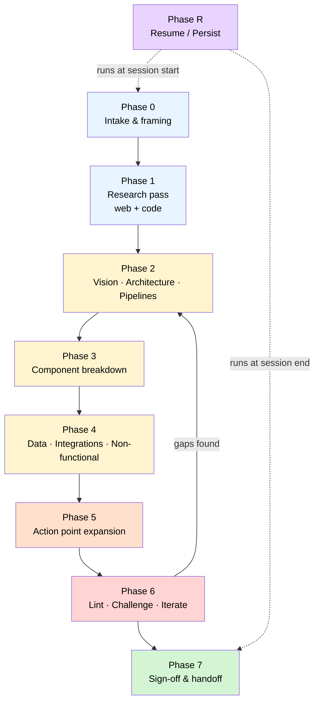
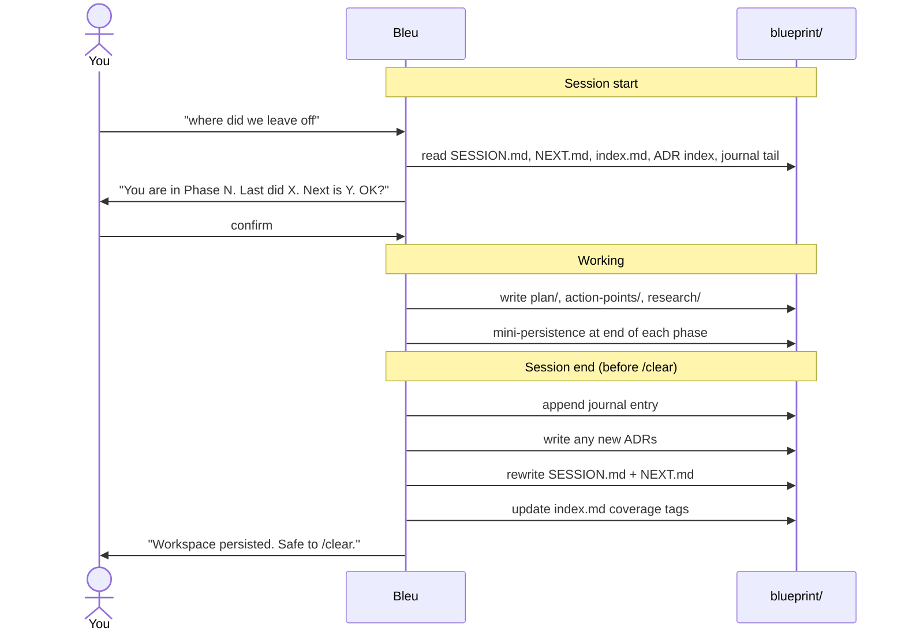
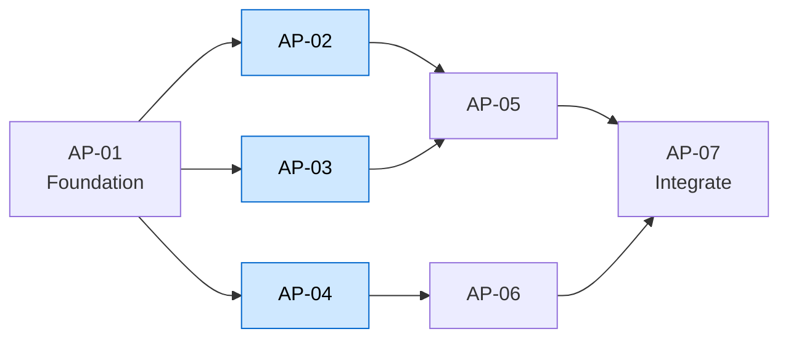
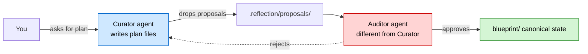
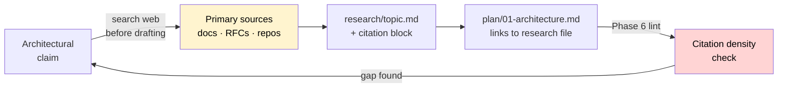
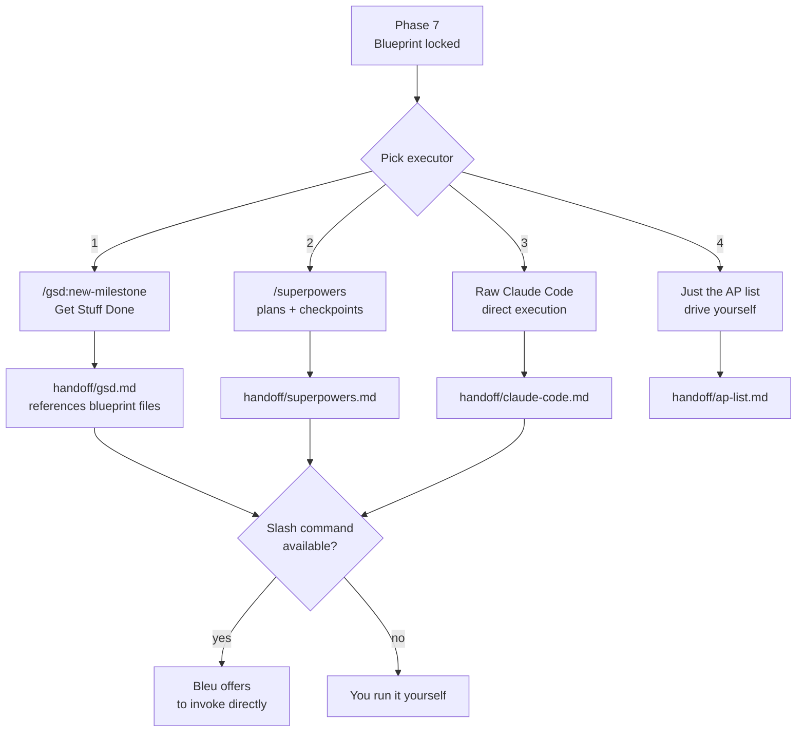
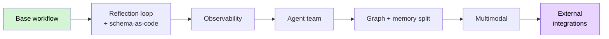

# Bleu

> Turn an idea into a deeply structured, file-backed system plan **before** writing any code.

A Claude Code skill that grows your idea into a navigable markdown wiki: vision, architecture, components, action points, research, citations, ADRs, and a session-persistence layer that survives `/clear`.


## Install

```
/plugin marketplace add Nirvaan05/Bleu-plugin
/plugin install bleu@bleu
```

Restart your Claude Code session. 

## Trigger phrases

| Intent | Say something like |
|---|---|
| Start a new blueprint | `help me blueprint this system`, `plan before coding`, `design the architecture for X`, `break this idea into components`, `expand into action points`, `full implementation plan` |
| Resume an existing blueprint | `where did we leave off`, `continue this plan`, `resume my blueprint` |

## At a glance

| Property | Value |
|---|---|
| Output | A `blueprint/` directory of markdown files in your working dir |
| Storage | Plain markdown. No vector DB, no embeddings, no chunking |
| Survives | `/clear`, terminal crashes, context-window resets |
| Hands off to | GSD, Superpowers, raw Claude Code, or a flat AP list |
| Granularity | 3 to 5 APs (tiny task) up to ~38 APs (greenfield system) |
| Research | Continuous, web-based, primary sources, every claim cited |
| Lint | Runs after every phase, not only at the end |

## The phased workflow

Eight phases. Sequential by default, lint after each one, free to loop back.



| # | Phase | Goal | Output |
|---|---|---|---|
| 0 | Intake & framing | Restate the idea, surface unknowns, confirm scope | `raw/intake.md` |
| 1 | Research pass | Ground in primary sources before drafting anything | `research/<topic>.md`, `raw/codebase-notes.md` |
| 2 | Vision · Architecture · Pipelines | Three opinionated documents with cited decisions | `plan/00-vision.md`, `01-architecture.md`, `02-pipelines.md` |
| 3 | Component breakdown | One page per component, clear ownership | `plan/03-components/<name>.md` |
| 4 | Data · Integrations · Non-functional | Schemas, APIs, performance, security, scaling | `plan/04`, `05`, `06`.md |
| 5 | Action point expansion | Decompose to executable units with deps | `action-points/AP-NN-<slug>.md` + dep graph |
| 6 | Lint · Challenge · Iterate | Find gaps, contradictions, edge cases, flaws | `plan/07-risks-open-questions.md` |
| 7 | Sign-off & handoff | Lock in, generate handoff artifact for executor | `handoff/<target>.md` |
| R | Resume / Persist | Survive context resets | `SESSION.md`, `NEXT.md`, journal entry, ADRs |

## The workspace anatomy

```
blueprint/
├── README.md                    entry point + navigation
├── SESSION.md                   current snapshot, read FIRST on resume
├── NEXT.md                      imperative next actions, read SECOND
├── journal.md                   append-only session history
├── index.md                     compact summary of every file
├── decisions/                   MADR-style ADR log
│   ├── README.md                ADR index with status table
│   └── ADR-NNN-<slug>.md
├── raw/                         raw inputs: transcripts, dumps, code excerpts
├── plan/
│   ├── 00-vision.md             problem, goals, non-goals, success criteria
│   ├── 01-architecture.md       diagram, layers, data flow, key decisions
│   ├── 02-pipelines.md          every flow end to end
│   ├── 03-components/           one file per component
│   ├── 04-data-model.md
│   ├── 05-integrations.md
│   ├── 06-non-functional.md
│   └── 07-risks-open-questions.md
├── action-points/               one file per AP + dep graph in README
├── research/                    web research notes with citations
└── outputs/                     answers to your queries, persisted
```

### Read order on resume

| Order | File | Tokens (approx) | Why |
|---|---|---|---|
| 1 | `SESSION.md` | ~300 | Current snapshot |
| 2 | `NEXT.md` | ~200 | Imperative next actions |
| 3 | `index.md` | ~500 | File map with coverage tags |
| 4 | `decisions/README.md` | ~200 | Status of every ADR |
| 5 | `journal.md` (last 1-2 entries) | ~800 | Recent context |

Total: ~2k tokens to fully orient. Then and only then does Bleu load specific `plan/` or `research/` files for the next action. Progressive disclosure all the way down.

## Session persistence

Five files keep the workspace alive across context resets. `SESSION.md` and `NEXT.md` are rewritten every session. `journal.md` and `decisions/` are append-only.



| File | Lifecycle | Purpose |
|---|---|---|
| `SESSION.md` | Rewritten every session | Current phase, status, blockers, where to read first on resume |
| `NEXT.md` | Rewritten every session | Imperative next steps + "Already done, do not redo" list |
| `journal.md` | Append-only | One entry per session: goal, outcome, decisions, deferrals, blockers |
| `decisions/ADR-NNN.md` | Append-only, MADR format | One file per architectural decision with status lifecycle |
| `decisions/README.md` | Updated when ADR added | Status table for fast scanning |

## Action points



Bleu builds a dependency graph at the bottom of `action-points/README.md` showing execution order and parallelizable groups (highlighted above).

### AP file template

| Field | Content |
|---|---|
| **Title** | One-sentence summary |
| **Depends on** | Other AP IDs that must complete first |
| **Files involved** | Exact paths, tagged create / modify / delete |
| **Code flow** | What happens, function by function, in prose |
| **Interfaces touched** | Function signatures, API contracts, schema changes |
| **Interactions** | How it talks to other components (named refs) |
| **Verification** | How you know this AP is done correctly |
| **Complexity** | S / M / L / XL with reasoning |
| **Open questions / risks** | Anything unresolved |

### Granularity scales to project size

| Project type | AP count | Why |
|---|---|---|
| Tiny task (bugfix, doc tweak) | 0 | Skip Bleu, just do it |
| Small task (new feature in existing code) | 3 to 5 | Coarse decomposition is enough |
| Medium project (subsystem rewrite) | 10 to 20 | Need explicit deps, no need for full vision |
| Greenfield system | ~38 | Full Phase 0 to 7, fine-grained APs, all integrations |

> Augment Code's research: multi-file tasks succeed at ~19% versus single-function tasks at ~87%. Smaller scope dramatically improves agent success rate. Anthropic's harness research adds: doubling task duration quadruples failure rate. Every agent degrades after ~35 minutes of human time.

## Adversarial linting (proposer-validator separation)

Bleu enforces this strictly: the same agent never both proposes and approves a change.



Why: Anthropic's harness research found that agents tend to confidently praise mediocre work when reviewing themselves. Different agent = honest review.

## Continuous research with citations



| What counts | What does not |
|---|---|
| Official docs (anthropic.com, mdn, rfc-editor.org) | Random Medium articles |
| Primary repos (github.com/owner/repo source) | SEO blog farms |
| Well-known engineering blogs | LLM training memory |
| RFCs and standards | Paraphrased recall |
| Conference talks with slides or transcripts | "I think" claims |

If Bleu catches itself thinking "I just knew that," the lint pass forces it to stop and search instead. Training knowledge is stale on tooling.

## Operating principles

The 14 constraints Bleu holds for the entire session.

| # | Principle | The bet |
|---|---|---|
| 1 | Plan, do not code | No implementation before sign-off |
| 2 | Be proactively suggestive | Challenge weak assumptions, propose alternatives |
| 3 | Continuous research is mandatory | Cite the source, never paraphrase from memory |
| 4 | Files outlast context | The conversation is ephemeral; the workspace is the deliverable |
| 5 | Treat chat as stateless, workspace as stateful | Anthropic Agent SDK's own guidance |
| 6 | Lint relentlessly | Done = you say it is near perfect |
| 7 | Adversarial evaluation | Different agent for proposing and validating |
| 8 | Write for the gap, not the overview | Every line earns its place |
| 9 | Audit the harness as models improve | Yesterday's workarounds are today's dead weight |
| 10 | Contamination control | Human-curated artifacts stay outside `blueprint/` |
| 11 | Start simpler than you think you need | Most blueprints do not need advanced features |
| 12 | Match granularity to scope | 3 APs for small, ~38 for greenfield |
| 13 | Ground truth beats LLM opinion | Tests, compilers, linters, the filesystem |
| 14 | The Curator owns the wiki | You source inputs, the agent does the bookkeeping |

## Handoff to your executor



The handoff artifact references blueprint files by relative path (e.g. `@blueprint/plan/01-architecture.md`) instead of paraphrasing the whole blueprint into one giant prompt. The blueprint **is** the source of truth.

## Claude Code integration (optional)

When Bleu detects it is running inside Claude Code, it offers four integrations as a menu (never silently).

| Integration | What it does | Trigger | Cost |
|---|---|---|---|
| **Hooks** | `SessionStart` loads index + health into context. `FileChanged` queues raw inputs for the Curator. `PreCompact` backs up the transcript. `Stop` runs git auto-commit | Configured in `.claude/settings.json` | Negligible |
| **KB Curator subagent** | Three modes (compile, lint, index). Hooks scoped to its own lifecycle. Tools whitelisted. `memory: project` for persistent learnings. Optional `isolation: worktree` for destructive lint passes | `.claude/agents/kb-curator.md` | One file |
| **Git auto-commits** | `Stop` and `SubagentStop` hooks stage `blueprint/` and commit asynchronously. Loop-protected. Distinct author. `git log -- blueprint/` recovers any phase | `.claude/hooks/git-autocommit.sh` | One shell script |
| **MCP servers** | Filesystem scoped to `blueprint/`, git, docs-fetch (e.g. context7), domain MCPs. Inline-scoped to the Curator so tool descriptions do not pollute the parent context | `.claude/.mcp.json` or inline in Curator frontmatter | Optional |

Bleu always shows you the files it would create **before** writing them.

## Advanced architecture (opt in, layered on top)

Beyond the base wiki and Claude Code integration, the workspace can become a self-improving system. Each capability is independent. Pick any subset.

| # | Capability | What it gives you |
|---|---|---|
| 1 | **Reflection loop** | Linter agent nominates new rules. Auditor agent (different agent) validates before they enter the schema. Self-improving wiki, human steers the rules |
| 2 | **Structure layers** | Knowledge graph at `.graph/graph.json` overlaid on markdown for backlinks. Episodic memory (`raw/`) split from semantic memory (`plan/`, `research/`) with bidirectional links |
| 3 | **Agent team** | Four locked-tool subagents: Researcher, Curator, Linter, Auditor. Hand off through files via hook-driven transitions. Proposer-validator enforced |
| 4 | **Schema as code** | Rules in `.claude/rules/blueprint-schema.md`, auto-loaded when any `blueprint/` file is accessed. ERROR violations block sign-off. Co-evolves via reflection loop |
| 5 | **Multimodal ingest** | PDFs, images, screenshots dropped in `raw/` get described and compiled. Generated diagrams live in `derived/` (regenerable, gitignored) |
| 6 | **Observability** | `.telemetry/events.jsonl` + wiki health score (0 to 100) in `.telemetry/health.md`. Computed from coverage, linkage, citation density, lint debt, reflection freshness. Surfaced on every `SessionStart` |
| 7 | **External integrations** | MCP servers ingest GitHub PRs/issues, Linear/Jira tickets, meeting transcripts, web search results into `raw/` automatically |

### Recommended adoption order



Do not take all seven on day one.

## Reference files

Eight reference files at `references/`. Loaded lazily, only when relevant.

| File | When Bleu reads it |
|---|---|
| `knowledge-base-pattern.md` | Phase 0/1, before creating workspace files |
| `session-persistence.md` | First session of any new blueprint, every resume |
| `action-point-template.md` | Phase 5, before writing APs |
| `research-and-citations.md` | Phase 1, every research pass |
| `handoff-formats.md` | Phase 7, when packaging for executor |
| `claude-code-integration.md` | When inside Claude Code and user wants automation |
| `advanced-architecture.md` | When user asks for any of the 7 capabilities |
| `landscape-research.md` | When justifying design choices, citing frontliner teams (PubNub, Effloow, EPAM, Anthropic Labs, ETH Zurich) |

## When to use Bleu

| Use it when | Skip it when |
|---|---|
| Starting a substantial system | One-off bugfix or 5-line tweak |
| Long project across multiple sessions | You already have a complete spec, just want to execute |
| Want every decision cited and ADR'd | Throwaway prototype where plan = code |
| Need a clean handoff to GSD/Superpowers/CC | Single afternoon of pair programming |
| Want to survive `/clear` and crashes | The whole task fits in one chat turn |

## Why Bleu makes long-running autonomous work safe

Frontliner teams that adopted spec-driven workflows (PubNub, Effloow, EPAM) report:

> The safe delegation window expands from **10 to 20 minute tasks** to **multi-hour feature delivery** once a real plan exists in files the agent can re-read.

Plan in files, not chat. Cite primary sources. Lint relentlessly. Survive context resets. Hand off cleanly.

## Repository layout

```
Bleu-plugin/
├── .claude-plugin/
│   └── marketplace.json              marketplace catalog
├── plugins/
│   └── bleu/
│       ├── .claude-plugin/
│       │   └── plugin.json           plugin manifest
│       └── skills/
│           └── bleu/
│               ├── SKILL.md          the skill itself
│               └── references/       eight reference files
├── README.md
├── LICENSE                           MIT
└── .gitignore
```

## License

MIT. See [LICENSE](./LICENSE).

## Author

Nirvaan Lagishetty ([@Nirvaan05](https://github.com/Nirvaan05))

## Core Contributors & Maintainers

- Nirvaan Lagishetty ([@Nirvaan05](https://github.com/Nirvaan05)) - creator, maintainer
- Hill Patel ([@STiFLeR7](https://github.com/STiFLeR7)) - core contributor, maintainer

## Contributing

Open an issue or PR. Version bumps go in **both** `marketplace.json` and `plugin.json` and must agree.
