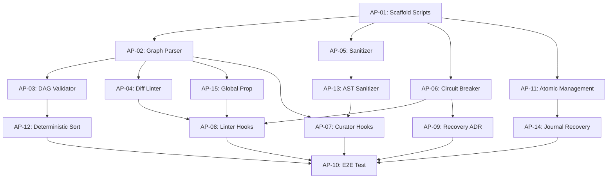

# Action Points: Bleu Stabilization

## Dependency Graph

## Recommended Execution Order
1. **Infrastructure (P0):** AP-01, AP-11
2. **Deterministic Engines:** AP-02, AP-05, AP-06, AP-13
3. **Algorithms:** AP-03, AP-04, AP-12, AP-15
4. **Harness Integration:** AP-07, AP-08, AP-09, AP-14
5. **Verification:** AP-10
