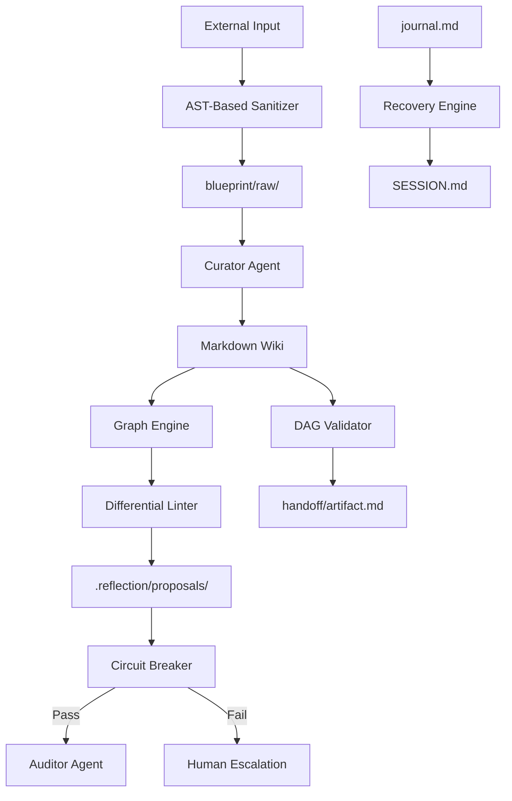

# Architecture: Industrialized Bleu Orchestration

## High-Level System Diagram
Bleu's core is now a **Deterministic Governance Layer** wrapped around the LLM Reasoning core.

## Core Components

### 1. AST-Based Sanitizer (Python/Parser)
- **Role:** Guards the `raw/` directory.
- **Action:** Parses Markdown to AST, normalizes unicode, and redacts dangerous patterns in code fences.

### 2. Graph Engine (Implicit-Aware)
- **Role:** Logical topology and blast-radius analysis.
- **Capability:** Computes `rdeps` and handles **Implicit Dependency Propagation** for global architectural files.

### 3. Differential Linter
- **Role:** Incremental validation.
- **Outcome:** Passes only affected files to the Linter agent based on graph `rdeps`.

### 4. Reflection Circuit Breaker (Root-Aware)
- **Role:** Loop protection with foundational file sensitivity.
- **Logic:** Tracks rejection counts. Root node failures trigger a **Global Hard Stop**.

### 5. DAG Validator (Deterministic)
- **Role:** Structural governance with stable tie-breaking.
- **Algorithm:** Kahn's Algorithm + Lexicographical sorting.

### 6. Atomic State Manager
- **Role:** Concurrent write protection.
- **Mechanism:** Temp-replace + File Locking.

### 7. Recovery Engine
- **Role:** Blueprint self-healing.
- **Mechanism:** Journal-replay state reconstruction.

## Key Decisions (ADRs)
- **ADR-001:** Kahn's Algorithm for AP Validation.
- **ADR-002:** Graph-aware incremental linting (rdeps).
- **ADR-003:** Root vs. Leaf quarantine circuit breaker.
- **ADR-004:** AST-based deterministic sanitization.
- **ADR-005:** Atomic state management.
- **ADR-006:** Deterministic DAG sort order.
- **ADR-007:** Journal recovery flow.
- **ADR-008:** Implicit dependency propagation.
